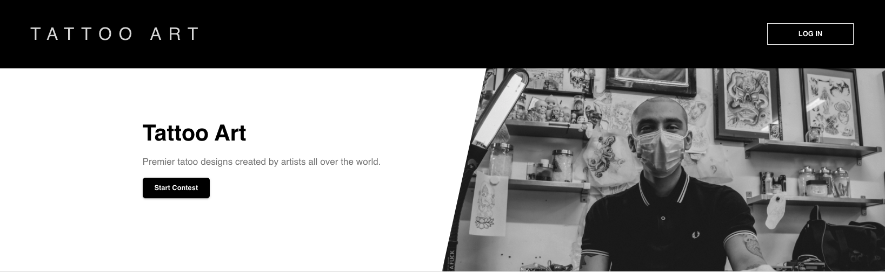
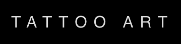
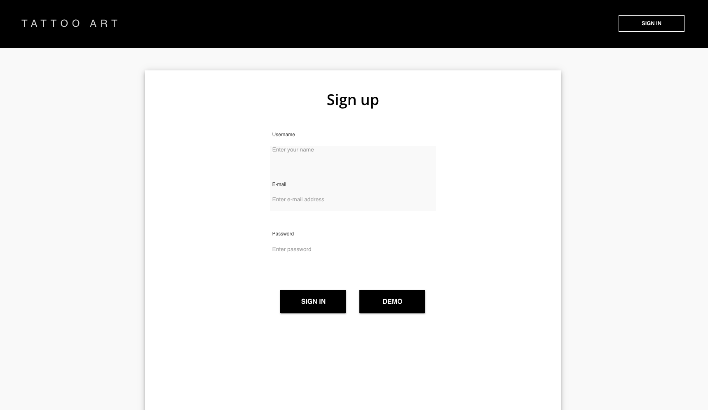
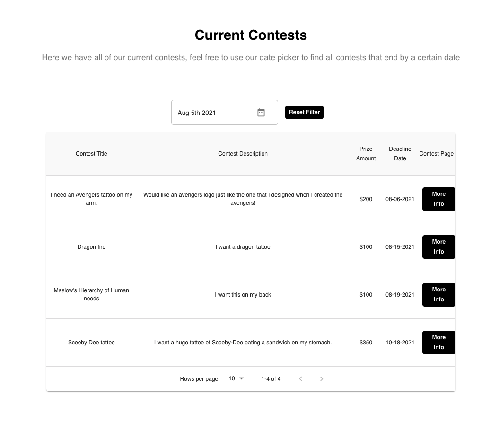
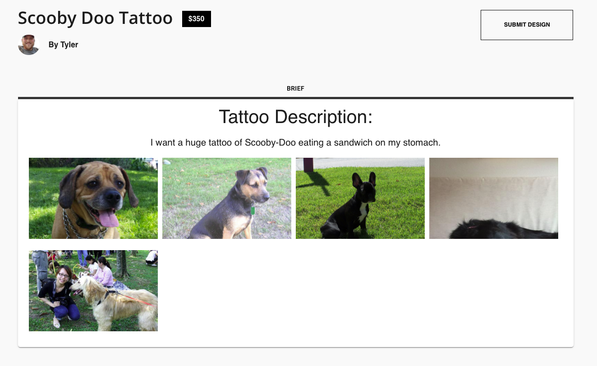
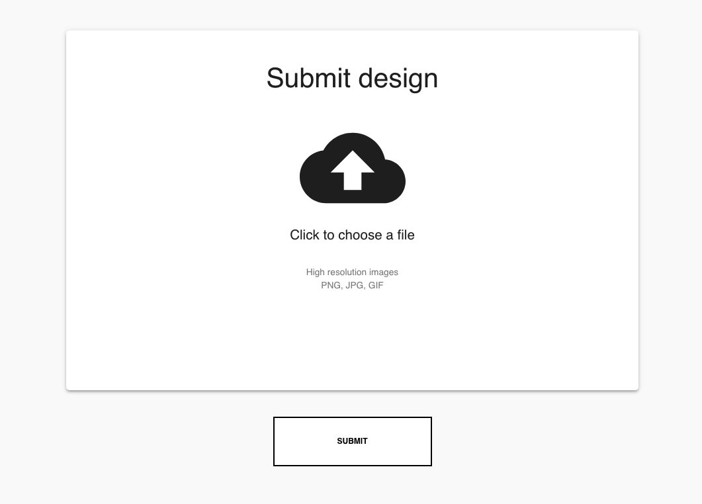

# Tattoo Art
[![Contributors][contributors-shield]][contributors-url]
[![Forks][forks-shield]][forks-url]
[![Stargazers][stars-shield]][stars-url]
[![Issues][issues-shield]][issues-url]
[![MIT License][license-shield]][license-url]
[![LinkedIn][linkedin-shield]][linkedin-url]

**Tech Stack:** MongoDB, Express.js, React.js, Node.js, Typescript

**Contributors: Brian Ford, Tyler Bolty, Jeewan Bhusal, Minh Tran**

<!-- PROJECT LOGO -->
 

  

  <h2 align="center">Tattoo Art</h3>

  

    An awesome README template to jumpstart your projects!
     
    <a href="https://github.com/hatchways/team-honey-cruller"><strong>Explore the repo »</strong></a>
     
     
    <a href="">View Demo (COMING SOON)</a>
    ·
    <a href="https://github.com/hatchways/team-honey-cruller/issues">Report Bug</a>
    ·
    <a href="https://github.com/hatchways/team-honey-cruller/issues">Request Feature</a>
  

<!-- TABLE OF CONTENTS -->

  
Table of Contents

  <ol>
    <li>
      <a href="#about-the-project">About The Project</a>
      <ul>
        <li><a href="#built-with">Built With</a></li>
      </ul>
    </li>
    <li>
      <a href="#getting-started">Getting Started</a>
      <ul>
        <li><a href="#installation">Installation</a></li>
      </ul>
    </li>
    <li><a href="#usage">Usage</a></li>
    <li><a href="#roadmap">Roadmap</a></li>
    <li><a href="#contributing">Contributing</a></li>
    <li><a href="#license">License</a></li>
    <li><a href="#contact">Contact</a></li>
    <li><a href="#acknowledgements">Acknowledgements</a></li>
  </ol>

<!-- ABOUT THE PROJECT -->
## About The Project

Tattoo Art is a project done by four up and coming developers looking to make their impact on the industry. This project was created through the Hatchways Career Accelerator Program. Tattoo Art was built using scrum methodologies. The idea of this website is to have a place to not only create contests in order to come out with a new tattoo design, but also for the designers to show off their work and artistic view. We have also added a messaging feature which will allow for contest owners to speak freely with the designers working on a contest.

## Built With

* [React](https://reactjs.org/docs/getting-started.html)
* [Typescript](https://www.typescriptlang.org/docs/)
* [Material UI](https://material-ui.com/)
* [Node](https://nodejs.org/en/docs/)
* [Mongo DB](https://docs.mongodb.com/)
* [AWS S3](https://aws.amazon.com/pm/serv-s3/?trk=ps_a134p000004f2aOAAQ&trkCampaign=acq_paid_search_brand&sc_channel=PS&sc_campaign=acquisition_US&sc_publisher=Google&sc_category=Storage&sc_country=US&sc_geo=NAMER&sc_outcome=acq&sc_detail=aws%20s3&sc_content=S3_e&sc_matchtype=e&sc_segment=488982706716&sc_medium=ACQ-P|PS-GO|Brand|Desktop|SU|Storage|S3|US|EN|Text&s_kwcid=AL!4422!3!488982706716!e!!g!!aws%20s3&ef_id=CjwKCAjwmK6IBhBqEiwAocMc8jmTp8dlfaDLW_ErbNkaAdIKgdcAW-DS8mbhH6AT4G3Y-1Ef6HlaNBoCYRYQAvD_BwE:G:s&s_kwcid=AL!4422!3!488982706716!e!!g!!aws%20s3)
* [Stripe](https://stripe.com/)
* [SendGrid](https://sendgrid.com/)
* [Google Login](https://developers.google.com/identity/sign-in/web/sign-in)

<!-- GETTING STARTED -->
## Getting Started
If you are running the repo locally, please follow the instructions below. 

## Installation

1. Clone the repo `git clone https://github.com/hatchways/team-honey-cruller.git`
   
1. Go into the server directory `cd server`
2. Run `npm install` to install packages
3. Create your environment variable (.env) file
4. Run `npm run dev` to start the server

<!-- USAGE EXAMPLES -->
## Usage

### Sign Up 

   
To use our application, feel free to either sign up as a new user or use our Demo User to tour the website with step by step directions.

### All Contests

   

Our Dashboard offers a variety of different things, such as Past Winners, Recent Reviews and Current Contests running.

### Single Contest

   

  By Clicking on the `More Info` button, this leads you to that specific contests page.

  
   

  If you click the `Submit Design` button on the Single Contest page, this will lead you to a place to submit a file with your design.

 
   
    Don't forget to go set your profile picture!

<!-- ROADMAP -->
## Roadmap

See the [open issues](https://github.com/othneildrew/Best-README-Template/issues) for a list of proposed features (and known issues).

<!-- CONTRIBUTING -->
## Contributing

Contributions are what make the open source community such an amazing place to be learn, inspire, and create. Any contributions you make are **greatly appreciated**.

1. Fork the Project
2. Create your Feature Branch (`git checkout -b feature/AmazingFeature`)
3. Commit your Changes (`git commit -m 'Add some AmazingFeature'`)
4. Push to the Branch (`git push origin feature/AmazingFeature`)
5. Open a Pull Request

<!-- LICENSE -->
## License

Distributed under the MIT License. See `LICENSE` for more information.

<!-- CONTACT -->
## Contact

Brian Ford - [bf2344](https://www.linkedin.com/in/bf2344) - bf@bford.dev

Tyler Bolty - [tsbolty](https://linkedin.com/in/tyler-bolty) - tsbolty@gmail.com

Jeewan Bhusal - [JB](https://www.linkedin.com/in/jeewanbhusal/) - jeewanbhusal@gmail.com

Minh Tran - [minhctran](https://www.linkedin.com/in/minhctran/) - pctran98@gmail.com

Project Link: [PROJECT LINK COMING SOON](https://github.com/your_username/repo_name)

<!-- ACKNOWLEDGEMENTS -->
## Acknowledgements
* [GitHub Emoji Cheat Sheet](https://www.webpagefx.com/tools/emoji-cheat-sheet)
* [Img Shields](https://shields.io)
* [Choose an Open Source License](https://choosealicense.com)
* [GitHub Pages](https://pages.github.com)
* [Animate.css](https://daneden.github.io/animate.css)
* [Loaders.css](https://connoratherton.com/loaders)
* [Slick Carousel](https://kenwheeler.github.io/slick)
* [Smooth Scroll](https://github.com/cferdinandi/smooth-scroll)
* [Sticky Kit](http://leafo.net/sticky-kit)
* [JVectorMap](http://jvectormap.com)
* [Font Awesome](https://fontawesome.com)

<!-- MARKDOWN LINKS & IMAGES -->
<!-- https://www.markdownguide.org/basic-syntax/#reference-style-links -->
[contributors-shield]: https://img.shields.io/github/contributors/hatchways/team-honey-cruller.svg?style=for-the-badge
[contributors-url]: https://github.com/hatchways/team-honey-cruller/graphs/contributors
[forks-shield]: https://img.shields.io/github/forks/hatchways/team-honey-cruller.svg?style=for-the-badge
[forks-url]: https://github.com/hatchways/team-honey-cruller/network/members
[stars-shield]: https://img.shields.io/github/stars/hatchways/team-honey-cruller.svg?style=for-the-badge
[stars-url]: https://github.com/hatchways/team-honey-cruller/stargazers
[issues-shield]: https://img.shields.io/github/issues/hatchways/team-honey-cruller.svg?style=for-the-badge
[issues-url]: https://github.com/hatchways/team-honey-cruller/issues
[license-shield]: https://img.shields.io/github/license/hatchways/team-honey-cruller.svg?style=for-the-badge
[license-url]: https://github.com/othneildrew/Best-README-Template/blob/master/LICENSE.txt
[linkedin-shield]: https://img.shields.io/badge/-LinkedIn-black.svg?style=for-the-badge&logo=linkedin&colorB=555
[linkedin-url]: https://linkedin.com/in/bf2344
